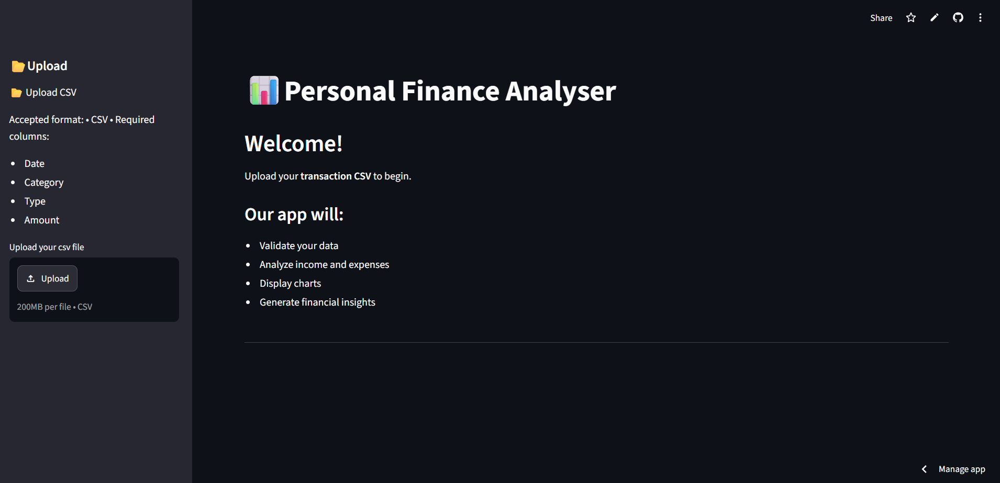
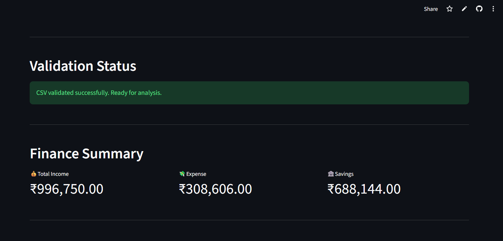
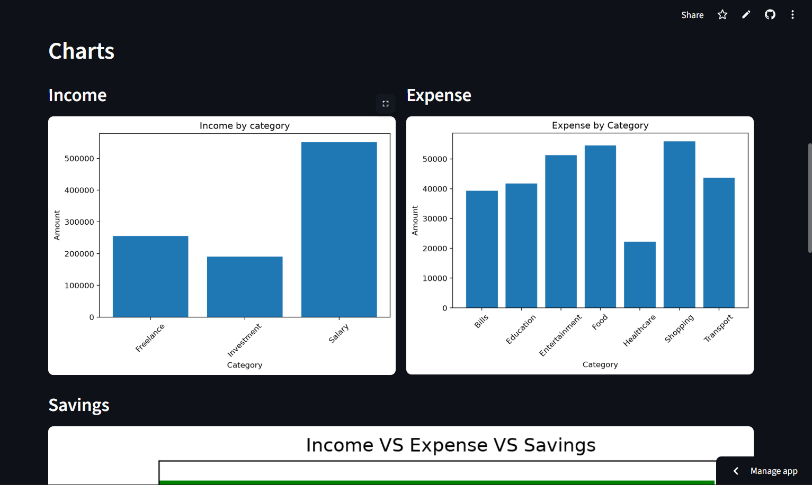
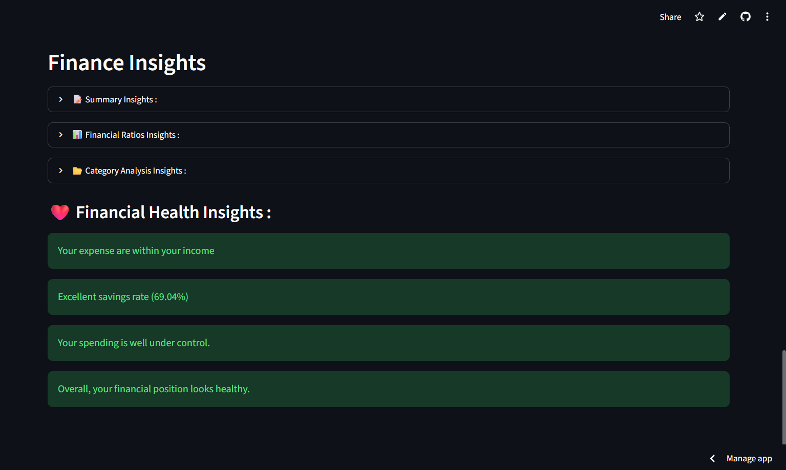

# 📊 Personal Finance Analyser

A Python-based web application that helps users analyze personal financial transactions from a CSV file. The application validates uploaded data, generates financial summaries, visualizes spending patterns, and provides meaningful insights through an interactive Streamlit interface.

🌐 **Live Demo:**  
https://personal-finance-analyser-rohinthan04.streamlit.app/

---

## ✨ Features

- 📁 Upload transaction data using a CSV file
- ✅ Automatic data validation before analysis
- 💰 Calculate Total Income, Total Expense, and Net Savings
- 📊 Category-wise Income and Expense Analysis
- 📈 Interactive Charts for financial visualization
- 💡 Automatically generated financial insights
- ⚠️ Detects invalid or inconsistent input data
- 🌐 Clean and responsive Streamlit interface

---

## 🛠️ Tech Stack

- **Language:** Python
- **Data Analysis:** Pandas
- **Data Visualization:** Matplotlib
- **Frontend:** Streamlit
- **Version Control:** Git & GitHub

---

## 📂 Project Structure

```text
Personal-Finance-Analyser/
│
├── app.py
├── requirements.txt
├── README.md
├── data/
│
├── src/
│   ├── reader.py
│   ├── validator.py
│   ├── analyser.py
│   ├── visualizer.py
│   └── insight_generator.py
│
└── assets/
    └── screenshots/
```

> *Folder names may vary slightly depending on your local project structure.*

---

## ⚙️ Installation

### 1. Clone the repository

```bash
git clone https://github.com/rohinthan04-ai/Personal-Finance-Analyser.git
```

### 2. Navigate to the project directory

```bash
cd Personal-Finance-Analyser
```

### 3. Install the required dependencies

```bash
pip install -r requirements.txt
```

### 4. Run the application

```bash
streamlit run app.py
```

---

## 🚀 Usage

1. Launch the Streamlit application.
2. Upload a valid CSV file containing financial transactions.
3. The application validates the uploaded data.
4. Explore:
   - Financial Summary
   - Income Analysis
   - Expense Analysis
   - Charts
   - Financial Insights

---

## 📸 Application Preview

| Home | Financial Summary |
|------|-------------------|
|  |  |

| Charts | Insights |
|--------|----------|
|  |  |
---

## 📈 Sample Workflow

```text
Upload CSV
     │
     ▼
 Reader Module
     │
     ▼
 Validator Module
     │
     ▼
 Analyzer Module
     │
     ▼
 Visualizer Module
     │
     ▼
 Insight Generator
     │
     ▼
 Streamlit Dashboard
```

---

## 🔮 Future Improvements

- Export analysis as PDF reports
- Monthly budget planning
- Multiple currency support
- Database integration
- User authentication
- AI-powered financial recommendations
- Monthly trend analysis
- Downloadable charts
- Interactive dashboard enhancements

---

## 📚 What I Learned

Through this project, I gained practical experience in:

- Object-Oriented Programming (OOP)
- Data Analysis with Pandas
- Data Visualization using Matplotlib
- Building Web Apps with Streamlit
- Writing Modular and Maintainable Code
- Git & GitHub Version Control
- Deploying applications using Streamlit Community Cloud

---

## 👨‍💻 Author

**Rohinthan**

- GitHub: https://github.com/rohinthan04-ai

---

## ⭐ Support

If you found this project useful, consider giving it a **⭐ Star** on GitHub.

Feedback and suggestions are always welcome!